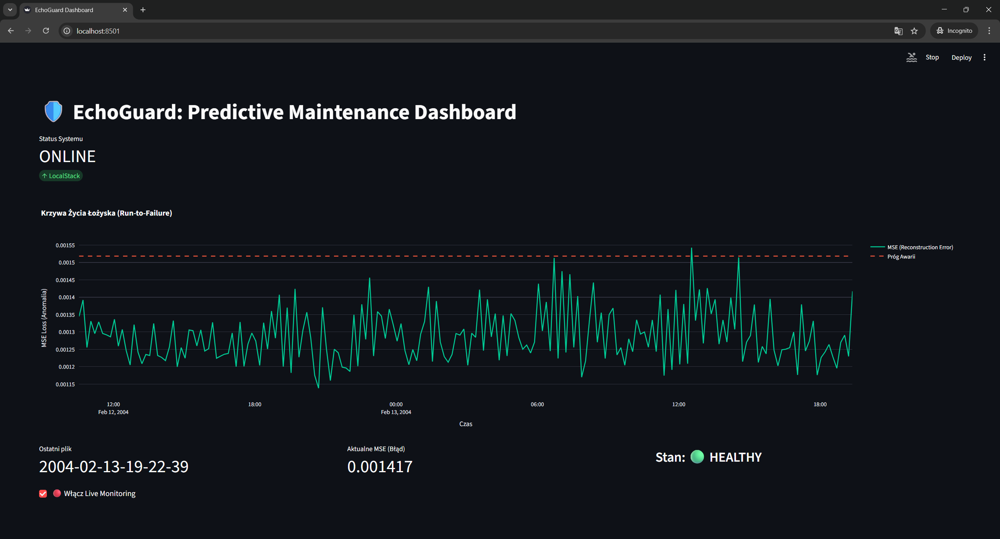
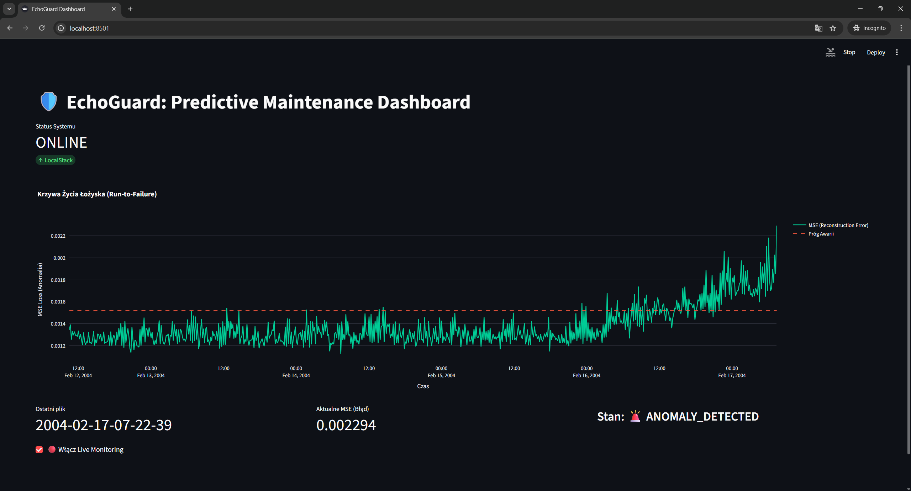

# 🛡️ EchoGuard: Serverless Predictive Maintenance System


**EchoGuard** is an IoT-Cloud system designed for **Predictive Maintenance** of rotating machinery. It uses Deep Learning (Autoencoders) to detect anomalies in vibration data before catastrophic failure occurs. The system features a serverless architecture simulated locally using LocalStack.

---

## 📉 Case Study: NASA IMS Bearing Dataset

The system was validated using the **NASA Intelligent Maintenance Systems (IMS) Bearing Dataset**. The goal was to predict the failure of a bearing that occurred after ~7 days of continuous operation.

### 1. Normal Operation (Healthy State)
In the early stages, the Autoencoder model successfully reconstructs the vibration patterns. The Reconstruction Error (MSE) remains low, indicating the machine is operating within normal parameters.


*> Dashboard showing stable, low MSE values during normal operation.*

### 2. Failure Prediction (Anomaly Detected)
Approximately **48 hours before the physical failure**, the system detects a shift in vibration characteristics (spectral patterns). The model fails to reconstruct these new patterns, causing the MSE to spike above the dynamic threshold, triggering an **"ANOMALY DETECTED"** alert.


*> Dashboard showing a critical spike in MSE, predicting the upcoming failure.*

---

## ✅ Quality Assurance & Testing Strategy

The project adheres to strict engineering standards with a comprehensive testing suite covering **100% of critical paths**.

| Type | Count | Tools | Description |
| :--- | :---: | :--- | :--- |
| **Unit Tests** | **21** | `pytest`, `unittest.mock` | Validates signal processing logic, mathematical correctness of tensor operations, and cloud handler logic in isolation using extensive mocking. |
| **E2E Tests** | **10** | `pytest`, `LocalStack` | Verifies the full cloud pipeline: File Upload -> S3 Trigger -> Dockerized Lambda -> ONNX Inference -> DynamoDB Storage. |
| **UI Tests** | **2** | `Playwright` | Automated browser testing for the Streamlit Dashboard, verifying data visualization and alert rendering in real-time scenarios. |

---

## 🛠️ Key Technical Features

### 1. Edge Computing & Bandwidth Optimization
Instead of streaming raw high-frequency vibration data (which is expensive and bandwidth-heavy), the Edge module performs **Signal Processing (STFT/Mel-Spectrograms)** locally. Only compressed feature maps are transmitted to the cloud.

### 2. High-Performance Serverless Inference
To mitigate the "Cold Start" problem in AWS Lambda:
* The model is trained in **TensorFlow/Keras** but exported to **ONNX**.
* Inference runs on **ONNX Runtime**, which is significantly lighter and faster than loading the full TensorFlow library in a Lambda environment.

### 3. Automated DevOps (Infrastructure as Code)
The entire environment is orchestrated via Docker Compose.
* **Zero-Touch Deployment:** A custom `init-aws` container waits for LocalStack to be healthy, automatically executes the deployment script (`build_and_deploy.py`), builds the Lambda package, and provisions the infrastructure.
* **No manual steps required** other than `docker-compose up`.

---

## 💻 Tech Stack

| Domain | Technology | Justification |
| :--- | :--- | :--- |
| **Cloud Backend** | **AWS Lambda, S3, DynamoDB** | Scalable, Serverless architecture (pay-per-use model). |
| **Cloud Emulation** | **LocalStack** | Enables offline cloud development without AWS costs. |
| **AI / ML** | **TensorFlow -> ONNX** | Training with Keras API, Inference optimization with ONNX. |
| **Visualization** | **Streamlit + Plotly** | Rapid development of interactive, real-time engineering dashboards. |
| **Containerization** | **Docker & Docker Compose** | Reproducible environments and IaC (Infrastructure as Code). |
| **Testing** | **Pytest & Playwright** | Robust testing for backend logic and frontend UI. |

---

## 🚀 How to Run

**Prerequisites:** Docker & Python 3.9+.

1.  **Clone the repository:**
    ```bash
    git clone [https://github.com/kwerulik/EchoGuard.git](https://github.com/kwerulik/EchoGuard.git)
    cd EchoGuard
    ```

2.  **Start the Infrastructure:**
    This command starts LocalStack and automatically runs the `build_and_deploy.py` script via the initialization container.
    ```bash
    docker-compose up --build
    ```

3.  **Launch the Dashboard:**
    Open a new terminal to run the UI.
    ```bash
    streamlit run dashboard/app.py
    ```

4.  **Start the Simulation:**
    Open another terminal to start feeding data from the Edge Simulator.
    ```bash
    python edge/advanced_simulator.py
    ```
    
5.  **Run Tests:**
    To verify system integrity:
    ```bash
    pytest
    ```

---

## 📂 Project Structure

* `/cloud` - AWS Lambda functions code (Inference Engine).
* `/edge` - IoT Device simulator performing signal preprocessing.
* `/dashboard` - Streamlit application for real-time monitoring.
* `/models` - Pre-trained Autoencoder model (ONNX format).
* `/notebooks` - Jupyter notebooks used for data exploration and model training.
* `/tests` - Comprehensive test suite (Unit, E2E, UI).
* `/src` - Helper modules and utility scripts.
* `build_and_deploy.py` - DevOps script for automated Lambda packaging and deployment.
* `docker-compose.yml` - Complete environment definition (Infrastructure as Code).
